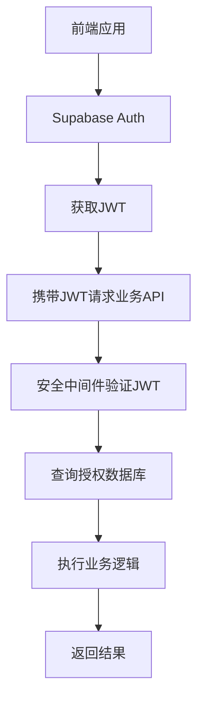

# Supabase认证授权微服务 - 产品需求文档

## 1. 产品概述

本项目旨在构建一个独立的、中央化的认证与授权微服务，利用Supabase作为核心身份提供者，实现对多个前端/后端应用的统一用户管理和精细化访问授权。

- 实现认证与业务逻辑的完全解耦，提供单点登录(SSO)的用户体验
- 提高整个系统生态的安全性与可维护性，支持多应用统一认证
- 目标是为企业级应用提供可扩展的认证授权解决方案

## 2. 核心功能

### 2.1 用户角色

| 角色 | 注册方式 | 核心权限 |
|------|----------|----------|
| 系统用户 | Supabase Auth注册 | 可访问已授权的业务应用 |
| 应用管理员 | 系统分配 | 可管理特定应用的用户授权 |

### 2.2 功能模块

本认证授权系统包含以下核心页面：

1. **认证模块**：JWT验证、用户身份确认
2. **授权模块**：用户应用访问权限管理
3. **数据库模块**：用户授权信息存储和查询
4. **安全中间件**：可重用的认证授权组件

### 2.3 页面详情

| 页面名称 | 模块名称 | 功能描述 |
|----------|----------|----------|
| 认证模块 | JWT验证器 | 验证Supabase签发的JWT令牌，解析用户身份信息 |
| 认证模块 | 身份提取器 | 从JWT中提取user_id等关键身份信息 |
| 授权模块 | 权限检查器 | 查询user_app_access表，验证用户对特定应用的访问权限 |
| 授权模块 | 应用访问控制 | 管理用户对不同应用的访问状态(active/inactive) |
| 数据库模块 | 用户授权表 | 存储用户与应用的访问关系，支持细粒度权限控制 |
| 数据库模块 | 触发器系统 | 自动为新注册用户创建初始授权记录 |
| 安全中间件 | FastAPI依赖项 | 提供可重用的认证授权装饰器和依赖注入 |
| 安全中间件 | Django中间件 | 为Django应用提供统一的认证授权处理 |

## 3. 核心流程

### 用户注册流程
1. 前端调用Supabase Auth进行用户注册
2. Supabase在auth.users表中创建用户记录
3. 数据库触发器自动在user_app_access表中创建初始授权记录

### 用户认证授权流程
1. 用户通过Supabase Auth登录获取JWT
2. 前端携带JWT向业务应用发起API请求
3. 业务应用的安全中间件验证JWT有效性
4. 查询user_app_access表确认用户对当前应用的访问权限
5. 授权通过后执行业务逻辑并返回结果

## 4. 用户界面设计

### 4.1 设计风格

- 主色调：蓝色系(#2563eb)，辅助色：灰色系(#64748b)
- 按钮风格：圆角设计，简洁现代
- 字体：系统默认字体，主要文字14px，标题18px
- 布局风格：卡片式布局，顶部导航
- 图标风格：线性图标，简洁明了

### 4.2 页面设计概览

| 页面名称 | 模块名称 | UI元素 |
|----------|----------|--------|
| 认证模块 | JWT验证器 | 简洁的API接口，无UI界面，专注后端验证逻辑 |
| 授权模块 | 权限管理 | 表格展示用户权限，状态指示器，操作按钮 |
| 数据库模块 | 数据管理 | 数据表视图，查询界面，状态监控面板 |
| 安全中间件 | 组件库 | 代码示例，配置界面，集成文档 |

### 4.3 响应式设计

本系统主要面向后端服务，采用API优先的设计理念。管理界面支持桌面端访问，提供基本的移动端适配。