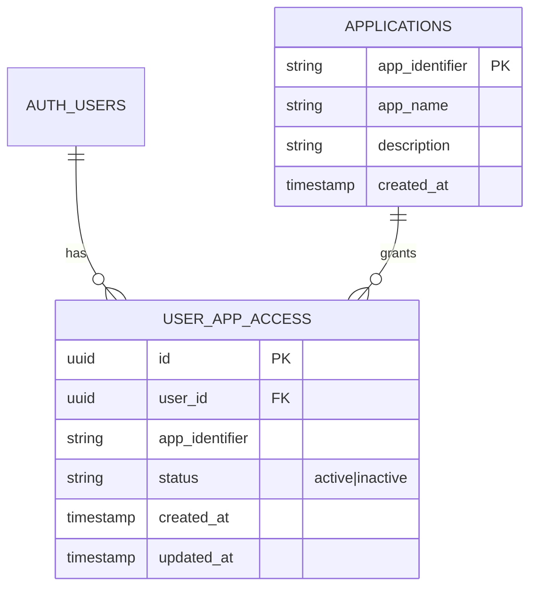

# Supabase 认证授权微服务 - 技术架构文档（精简版）

本项目专注：构建一个独立的、中央化的“认证与授权服务”。

- 不开发前端页面（仅提供后端 API）。
- 不开发任何业务应用（文档中的业务应用仅用于说明流程）。
- 不创建 auth.users 表（该表由 Supabase Auth 自动提供与维护）。
- 仅关注“认证（JWT 校验）与授权（访问控制）”能力，不涉及任何业务逻辑。

## 1. 总体架构

```mermaid
graph TD
    A[客户端/业务应用] -->|携带JWT| B[认证授权服务 (本项目)]
    B --> C[JWT 验证模块]
    B --> D[授权检查模块]
    D --> E[(共享业务数据库)]
    C --> F[Supabase Auth (外部系统)]
```

说明：
- 业务应用（A/B/C）不在本项目范围内，只是调用方示意；本项目仅提供可复用的认证与授权 API。
- Supabase Auth 提供身份与 JWT，auth.users 为外部系统表，本项目不创建此表。

## 2. 技术栈与边界

- 后端框架：FastAPI（Python 3.12）
- 身份与认证：Supabase Auth（JWT 由 Supabase 签发）
- 授权数据：PostgreSQL（建议使用 Supabase 项目自带数据库中的业务表）
- 客户端 SDK：supabase-py（服务端使用 service_role 访问 PostgREST）
- 部署：可 Docker/非 Docker，本文档不强制要求

不包含：
- 前端实现
- 任何具体业务应用的实现

## 3. 路由与接口

仅提供与认证/授权直接相关的最小 API：

| 路由 | 方法 | 用途 |
|------|------|------|
| /health | GET | 健康检查 |
| /auth/verify | POST | 验证 Supabase 签发的 JWT 是否有效，返回基本身份信息 |
| /auth/check-access | POST | 基于 user_app_access 表检查用户对某应用的访问权限 |

### 3.1 请求与响应模型

- JWT 验证接口
  - 请求：`{ token: string }` 或使用 `Authorization: Bearer <jwt>`
  - 响应：`{ valid: boolean, user_id?: string, email?: string }`

- 授权检查接口
  - 请求：`{ user_id: string, app_identifier: string }`
  - 响应：`{ has_access: boolean, status?: 'active'|'inactive' }`

说明：授权接口中的 user_id 可由上游在完成 JWT 验证后传入；也可由调用方自行解 JWT 得到（两种模式由业务自由选择，本项目仅提供最小能力）。

## 4. 数据模型（业务侧）

本项目不创建 auth.users 表，该表由 Supabase Auth 提供。业务授权数据建议使用以下两张表：



建议的 DDL（在 Supabase 数据库中执行，示例）：

```sql
-- 用户应用访问表
CREATE TABLE IF NOT EXISTS user_app_access (
    id UUID PRIMARY KEY DEFAULT gen_random_uuid(),
    user_id UUID NOT NULL,
    app_identifier VARCHAR(50) NOT NULL,
    status VARCHAR(20) DEFAULT 'active' CHECK (status IN ('active', 'inactive')),
    created_at TIMESTAMPTZ DEFAULT now(),
    updated_at TIMESTAMPTZ DEFAULT now()
);

CREATE INDEX IF NOT EXISTS idx_user_app_access_user_id ON user_app_access(user_id);
CREATE INDEX IF NOT EXISTS idx_user_app_access_app_identifier ON user_app_access(app_identifier);
CREATE UNIQUE INDEX IF NOT EXISTS idx_user_app_access_unique ON user_app_access(user_id, app_identifier);

-- 应用信息表
CREATE TABLE IF NOT EXISTS applications (
    app_identifier VARCHAR(50) PRIMARY KEY,
    app_name VARCHAR(100) NOT NULL,
    description TEXT,
    created_at TIMESTAMPTZ DEFAULT now()
);

-- 触发器函数：当 Supabase 的 auth.users 新增用户时，为其创建默认访问权限
CREATE OR REPLACE FUNCTION create_user_app_access()
RETURNS TRIGGER AS $$
BEGIN
    INSERT INTO user_app_access (user_id, app_identifier, status)
    SELECT NEW.id, app_identifier, 'active'
    FROM applications
    WHERE app_identifier IN ('app_default');
    RETURN NEW;
END;
$$ LANGUAGE plpgsql;

-- 触发器：注意 auth.users 为 Supabase 外部系统表，本项目不创建
DROP TRIGGER IF EXISTS trigger_create_user_app_access ON auth.users;
CREATE TRIGGER trigger_create_user_app_access
    AFTER INSERT ON auth.users
    FOR EACH ROW
    EXECUTE FUNCTION create_user_app_access();

-- 初始化应用示例数据（按需调整）
INSERT INTO applications (app_identifier, app_name, description) VALUES
('app_default', '默认应用', '所有新用户默认可访问的应用')
ON CONFLICT (app_identifier) DO NOTHING;

-- RLS 策略（可选：若服务使用 service_role，可放宽；此处仅示例）
ALTER TABLE user_app_access ENABLE ROW LEVEL SECURITY;
CREATE POLICY IF NOT EXISTS "Users can view own access" ON user_app_access
    FOR SELECT USING (auth.uid() = user_id);
```

## 5. 配置与环境变量

服务通过环境变量读取配置（不在代码中硬编码任何密钥）：
- SUPABASE_URL：Supabase 项目 URL
- SUPABASE_SERVICE_ROLE_KEY：服务角色密钥（仅服务端使用）
- SUPABASE_JWT_SECRET：用于校验 JWT 的密钥（与 Supabase 项目设置一致）

建议将上述变量放入部署平台的安全配置或本地 .env 文件（切勿提交到版本库）。

## 6. 运行方式（概览）

- 开发：使用 FastAPI + Uvicorn 启动服务
- 典型命令：`uvicorn app.main:app --reload --port 8000`
- 依赖：`fastapi, uvicorn[standard], PyJWT, supabase`

## 7. 设计原则回顾

- 本项目严格聚焦“认证 + 授权”能力；业务逻辑由各业务应用自理。
- 不开发前端；业务应用仅为示意。
- auth.users 由 Supabase 自动提供，本项目不创建该表。
- 接口最小可用，便于被不同技术栈的业务应用复用。